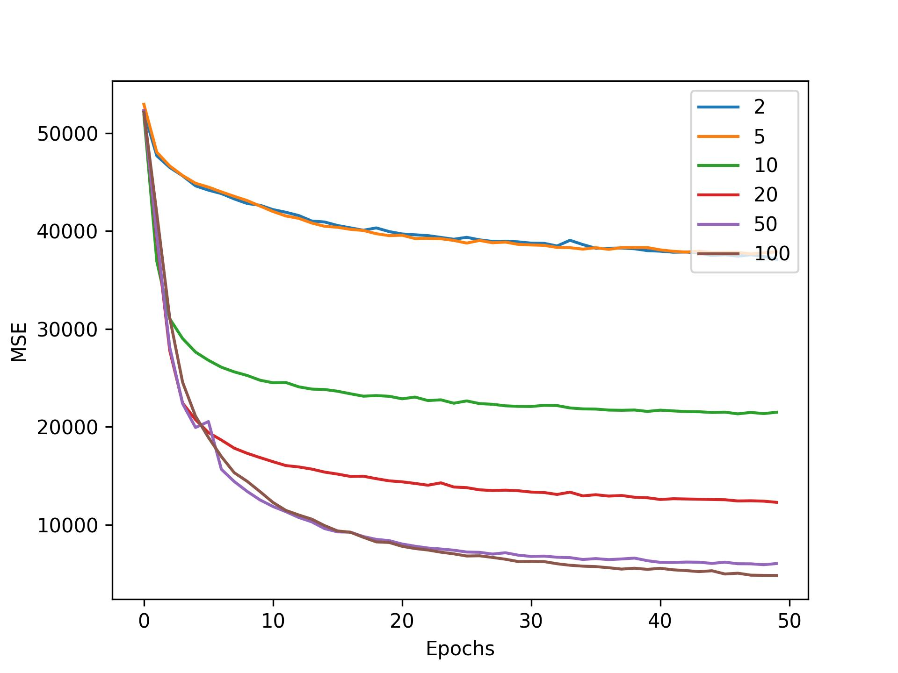
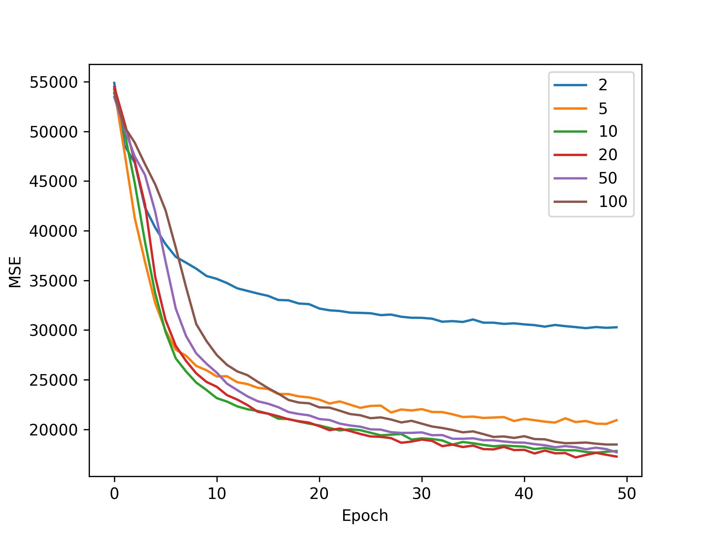
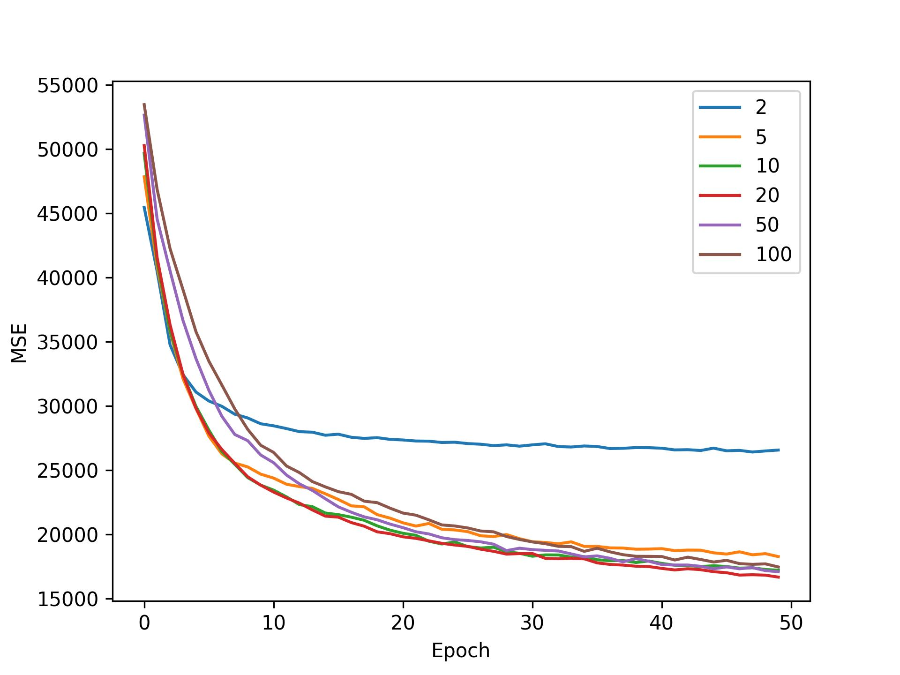
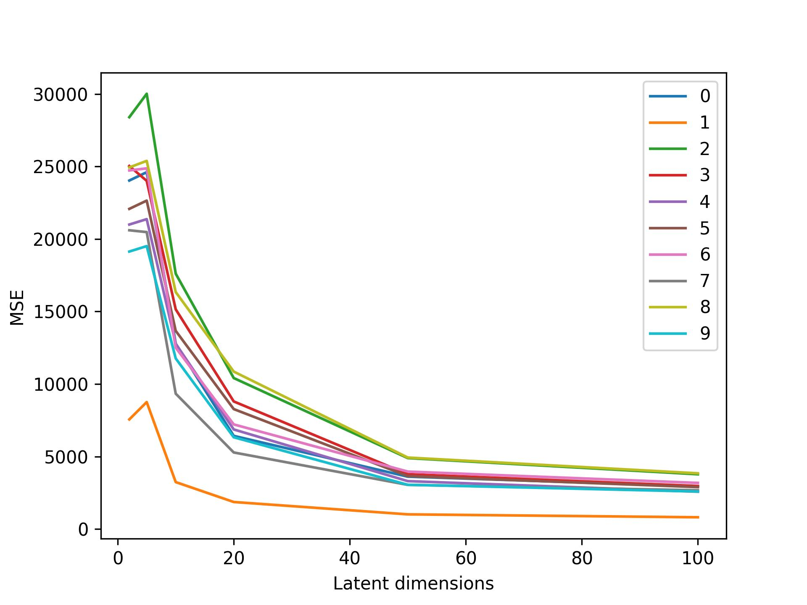
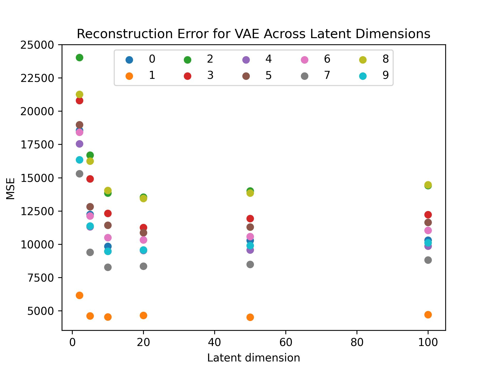
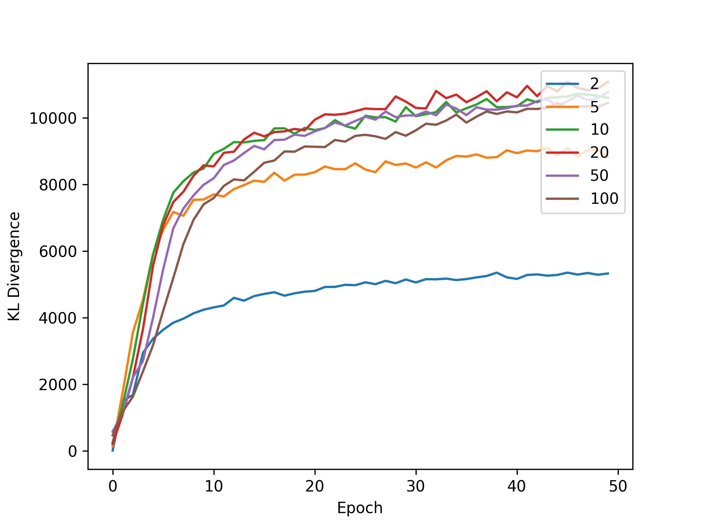
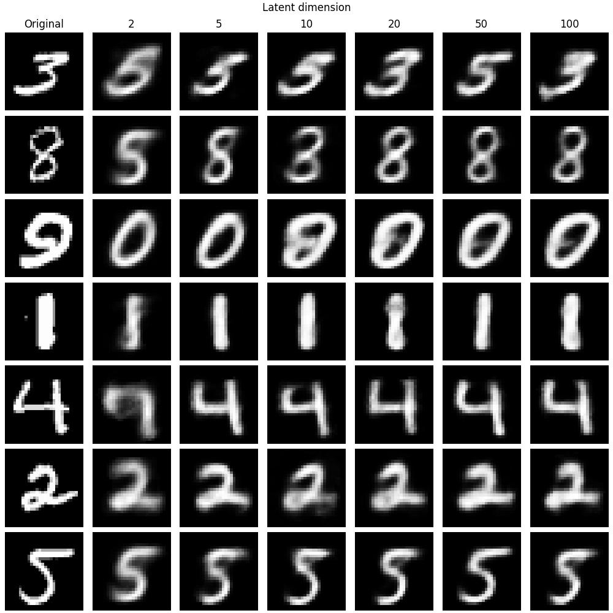
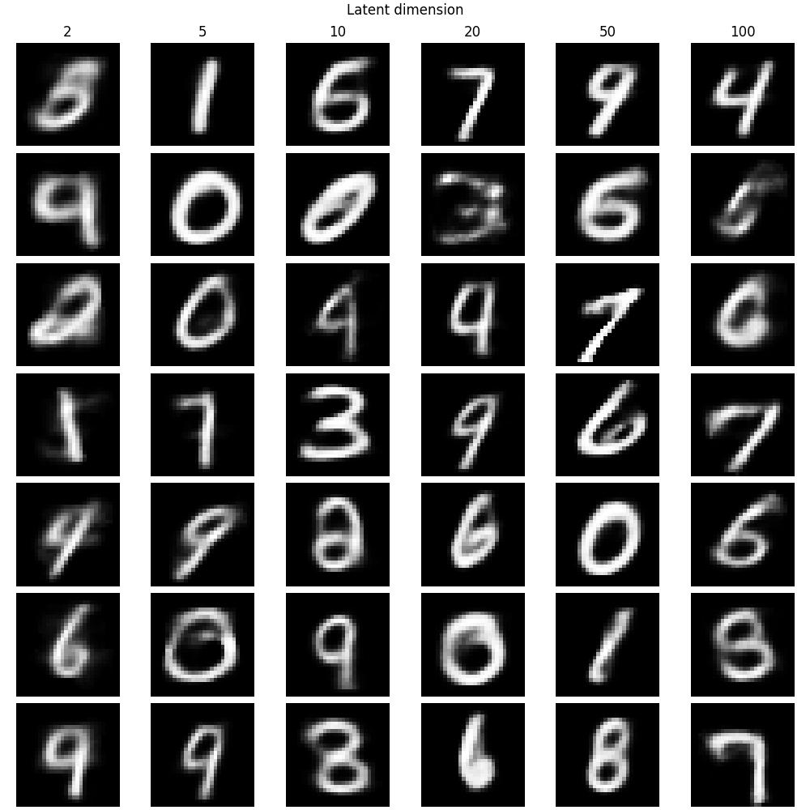

note that we don't need normalization since the network is very shallow

here we can use log_var or var, doesn't matter

1. Train autoencoders for 30 epochs, plot train/val, select best latent dim
based on val reconstruction error. Plot line graphs for each digit (MSE on y, latent size on x) on test data.
2. Visualize (on test data) across all latent dims in a grid, against real data.
3. Plot tSNES, compare all latent dims in a grid.
4. Repeat steps for VAE.
5. For each AE VAE pair, compare reconstruction losses.
6. Pick best VAE and generate new samples from noise, and show lack of guided generation.
6. Fix this issue with conditional VAE (repeat steps).

## Latent Space Dimensionality

  
   
  

[//]: # ()
[//]: # (
)

[//]: # (    
)

[//]: # (        )

[//]: # (    
)

[//]: # (    
)

[//]: # (        )

[//]: # (    
)

[//]: # (    
)

[//]: # (        )

[//]: # (    
)

[//]: # (    <figcaption>)

[//]: # (        Validation losses for Autoencoders &#40;left&#41;, VAE &#40;middle&#41;, and )

[//]: # (        ConditionalVAE &#40;right&#41;. )

[//]: # (    </figcaption>)

[//]: # (
)

    
    

## Choosing Optimal Latent Space Dimensionality

[//]: # (![img]&#40;output/Autoencoder/validation_MSE.jpg&#41;)

[//]: # (![img]&#40;output/Autoencoder/class_results_MSE.jpg&#41;)

[//]: # (![img]&#40;output/Autoencoder/reconstruction_grid.jpg&#41;)

## VAE

