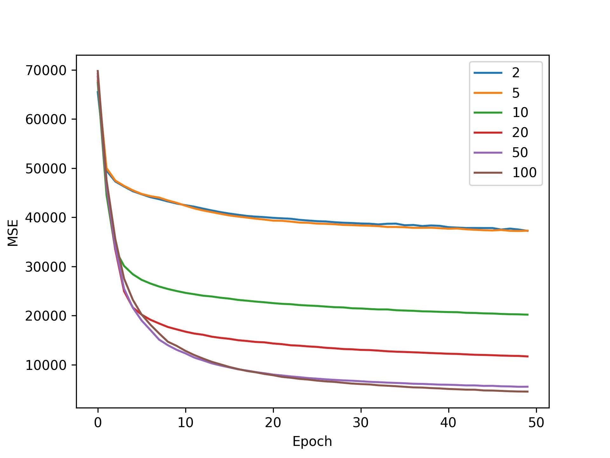
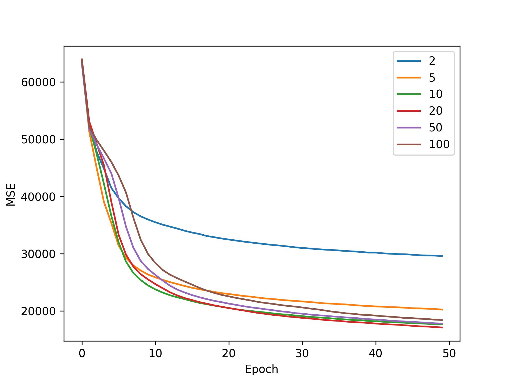
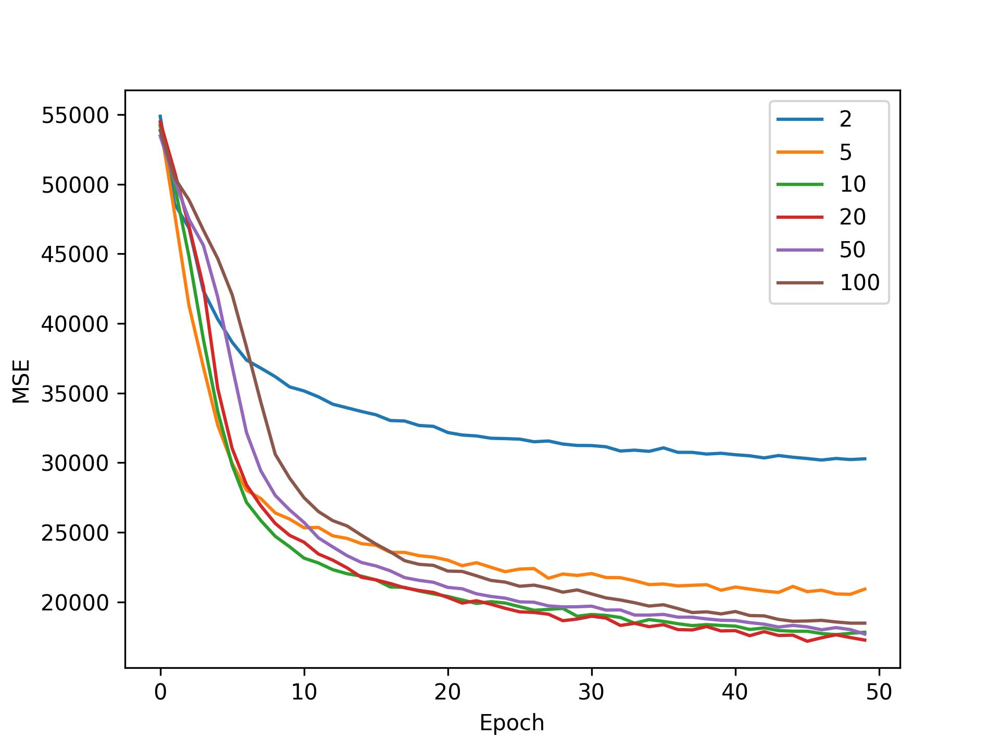
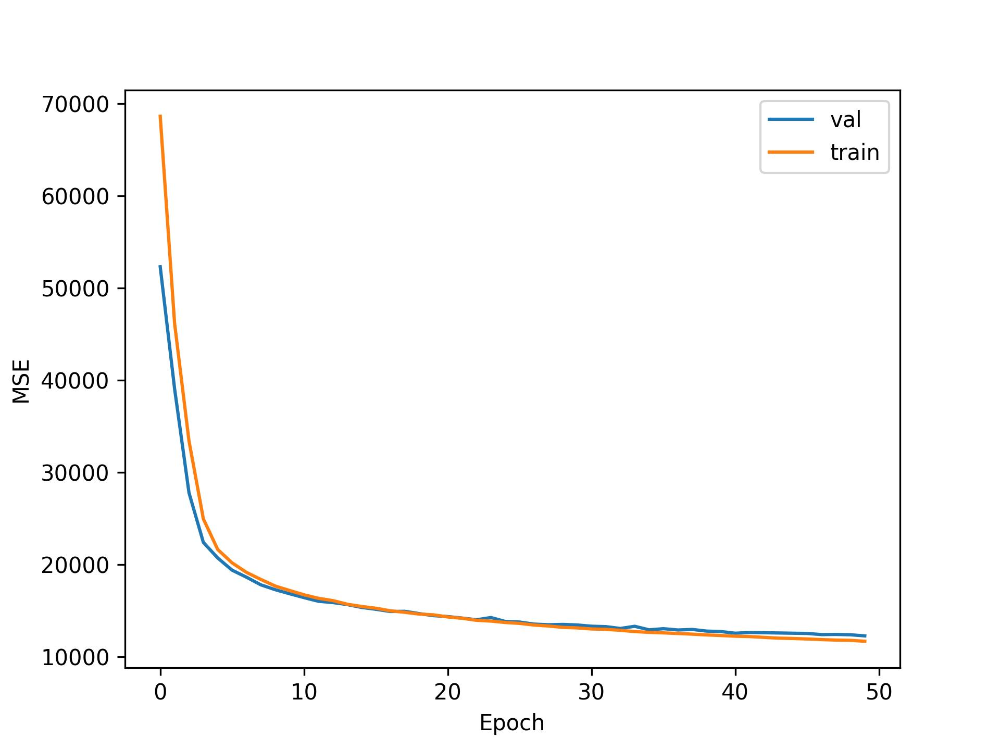
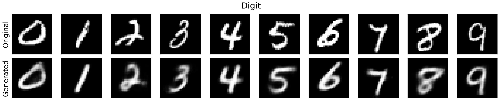

# Variational Autoencoders for Image Generation
The goal of this project is to explore and better understand variational
autoencoders (VAEs), and how they are used for image generation in practice. In this
document, we will briefly describe VAEs, before walking through the implementation,
training (& validation), testing, and visualization.

## Introduction
Variational Autoencoders (VAEs) represent a powerful class of probabilistic 
generative models that aim to model an underlying distribution of real-world 
data. Coupled with their ability to learn deep representations of such data, 
VAEs are capable of generating entirely new data points using variational 
inference. Unlike traditional autoencoders, which deterministically reconstruct 
outputs from discrete latent representations, VAEs probabilistically generate 
outputs, by sampling from a continuous latent space. For any given input x, 
the encoder of a VAE attempts to learn a mapping of x to a probability 
distribution, which is assumed to be Gaussian (i.e. roughly standard normal). 
This property, sometimes referred to as latent space regularization, is 
achieved by incorporating Kullback-Leibler (KL) Divergence, which measures 
the distance (or dissimilarity) between two probabilities distributions, and 
effectively encourages the modeled latent distributions to be close to standard 
normal.

## Implementation
Model design and training were implemented in PyTorch.
### Architecture
The encoder and decoders use only linear layers and ReLU activations. To enable
differentiability, we use the "reparameterization trick," which allows sampling
from the latent distribution z ~ p_theta(z|x). The output is normalized between 
[0, 1.0] using the sigmoid function. Note that since the network is shallow,
additional normalization (e.g. batch normalization) is not necessary.

### Loss
* __Reconstruction Loss__: To compare generated images with ground truth (original images),
we measure the reconstruction error. Common reconstruction losses include __Binary Cross Entropy (BCE)__
and __Mean Squared Error (MSE)__. While both are acceptable, in this implementation we use MSE loss, primarily for
two reasons: (1) BCE is both asymmetric and biased around p=0.5 [], and (2) BCE is designed for outputs that
model probabilities. Since images are supposed to...
* __KL Divergence__: Kullback-Leibler (KL) Divergence

## Training & Validation
A vanilla autoencoder (baseline) and VAE were trained on the MNIST
dataset, which contains handwritten digits labeled 0 through 9 (totaling 10 classes). 
The original training set consists of 60k images, each as 28 x 28, 8-bit unsigned
gray scale images. From this set, 10% were randomly chosen for validation (6k images)
to guide model selection. Each model was configured with a different latent size 
(i.e. 2, 5, 10, 20, 50, or 100). Training was conducted for 50 epochs on 
a single NVIDIA V100 GPU, utilizing batch sizes of 1024. Note that images were 
first converted to floating point tensors in the range [0, 1.0]. Optimization was 
carried using AdamW [], with a learning rate of 1e-3 and default weight decay parameters.
Training and validation losses were recorded for each epoch.

  
  

 
  <i>Training (left) and validation (right) losses recorded for the vanilla autoencoder.</i>

  
  

 
  <i>Training (left) and validation (right) losses recorded for the VAE.</i>

### Effect of Latent Space Dimensionality on Digit Reconstruction

  
  

* Increasing the dimensionality of the latent space expectedly decreases image
reconstruction error across all digits for the vanilla autoencoder. In general,
increasing the degree of information that needs to be compressed by the encoder
makes it harder for the decoder to reconstruct the original image. 

* In contrast, for the VAE we see that higher latent sizes do not meaningfully
reduce reconstruction error. In fact, the MSE worsens slightly for nearly all 
digits, which perhaps reveals that either (1) the model is underfitting the data as
it struggles to generate continuous latent space representations, or (2) the model
is overfitting to the training data because of the increased capacity. Regardless,
it seems that most of the semantic information of MNIST digits can be compressed 
in a relatively small latent space.

* __Some digits are harder.__ Another important observation is that some digits are harder to reconstruction
than others. We see that digits 1 and 7 are easiest to reconstruct, since they
are both composed of straight lines, and digits 2 and 8 are hardest, as they
are more complex (loops and curves).

### Model Selection: Choosing Optimal Latent Space Dimensionality 
Based on the reconstruction errors of the VAE model on the validation
split, a latent size of 20 was chosen. 

  

## Visualizing Image Reconstructions
We can visualize the generative capabilities of the VAE model (selected with a 
latent size of 20). Below, the images are reconstructed using both the encoder and
decoder, from unseen test data:

  

 
  <i>Original MNIST images (top) and the reconstructed images (bottom) for the VAE.</i>

### Decoder-Only Image Reconstruction (Generation)
What happens when we want to generate a new MNIST-like image? Well, we actually
don't need the encoder, and can feed a sample z ~ N(0, 1) to the decoder directly
to reconstruct an image from z:

  

 
  <i>Generated MNIST images using the decoder portion of the VAE.</i>

Here, we see that the images produced are pretty good, but some reconstructions 
are not legible. This is due to the fact that the VAE does not know which digits 
to produce, as it is only responsible for reconstructing an image from the sampled 
noise vector z. Because of this lack of information, z can lie somewhere in-between 
distributions in the latent space, representing a "mixture" of more than one digit.

### Guided Image Generation with ConditionalVAEs
Up until this point, the MNIST labels were not incorporated into the training 
process, and so the relationship between images and their labels were not encoded
into the latent space. Can we somehow encode the digit class into the latent space
in order to generate a specific digit? The answer is yes! By slightly modifying
the architecture of the VAE, we can allow the encoder and decoder to both 
accept an additional vector. We simply one-hot encode the label and concatenate both
the input x and latent variable z, with the vectorized label. By doing so, we
can generate a new sample from a specific class. 

