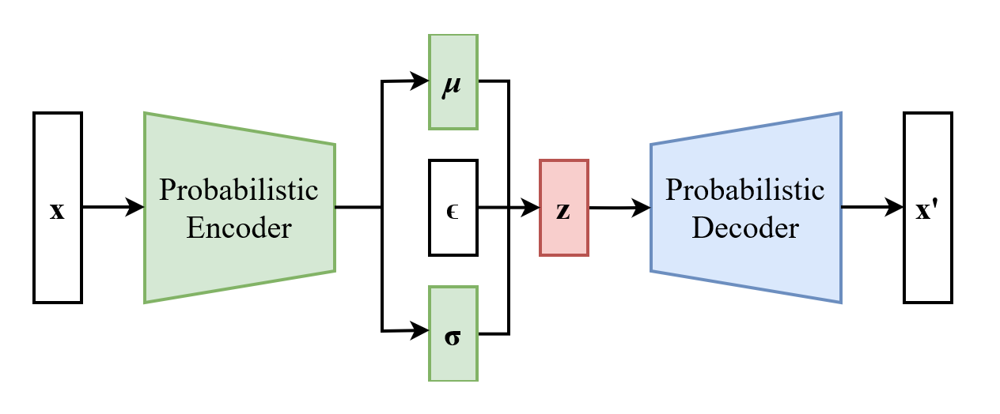
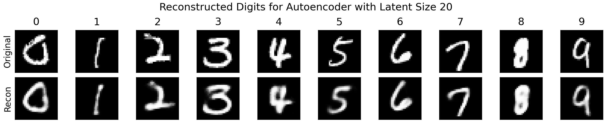
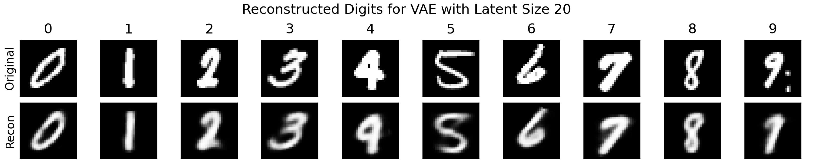
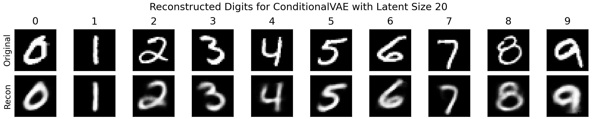
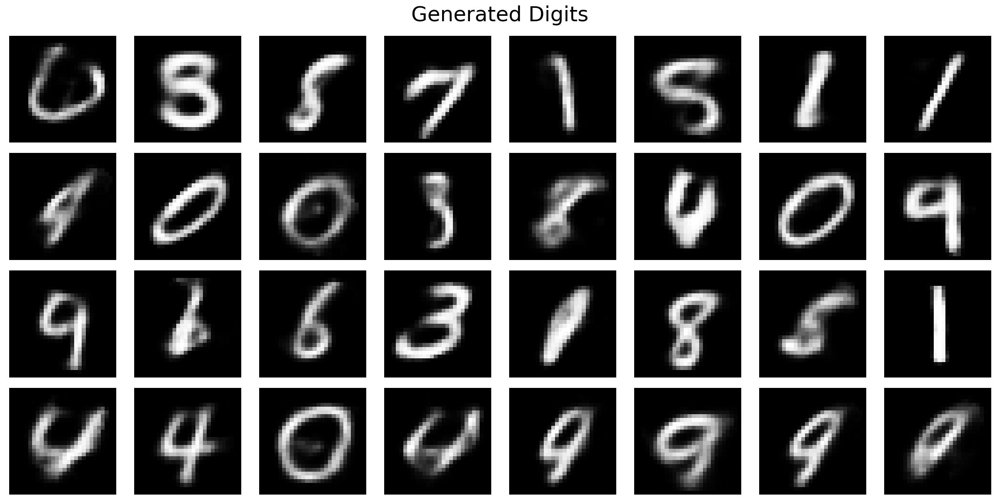
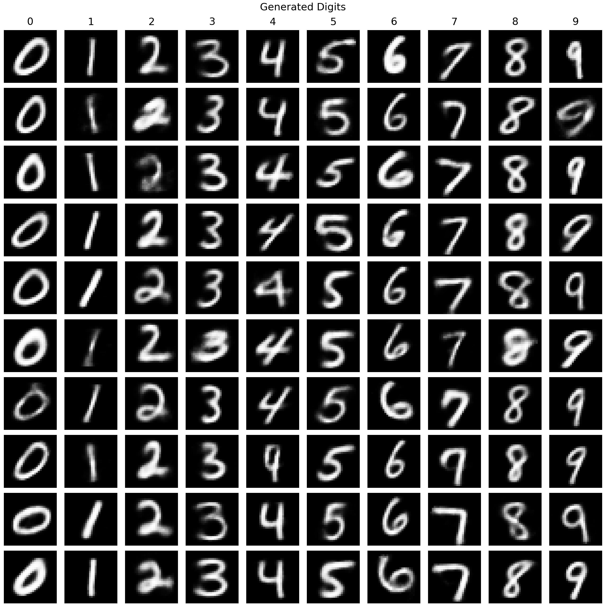
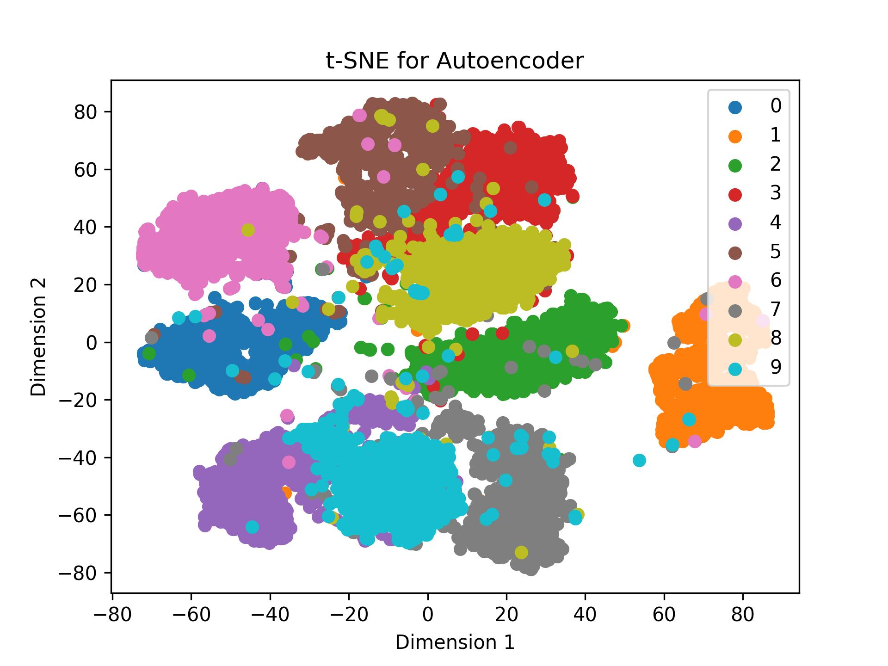
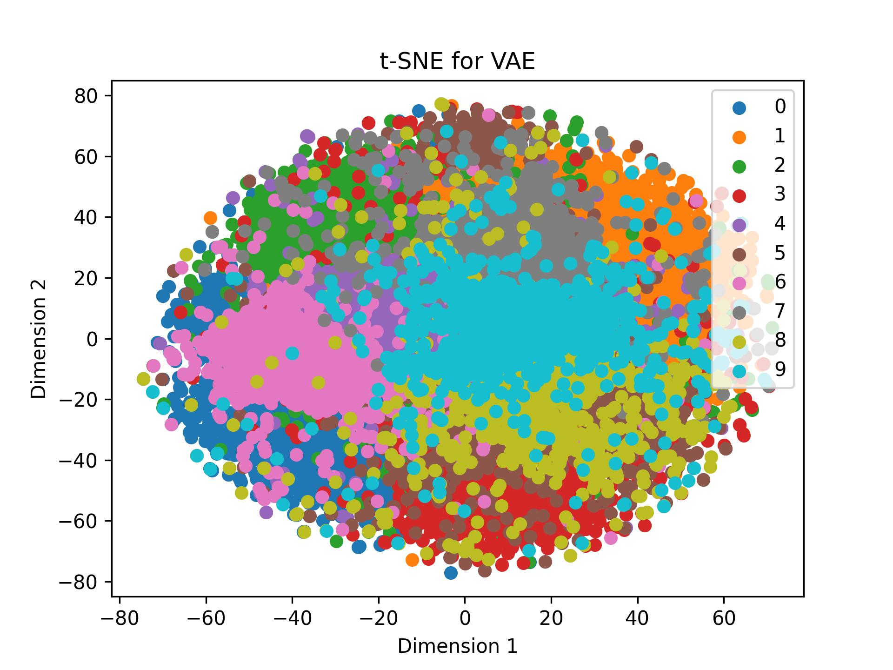
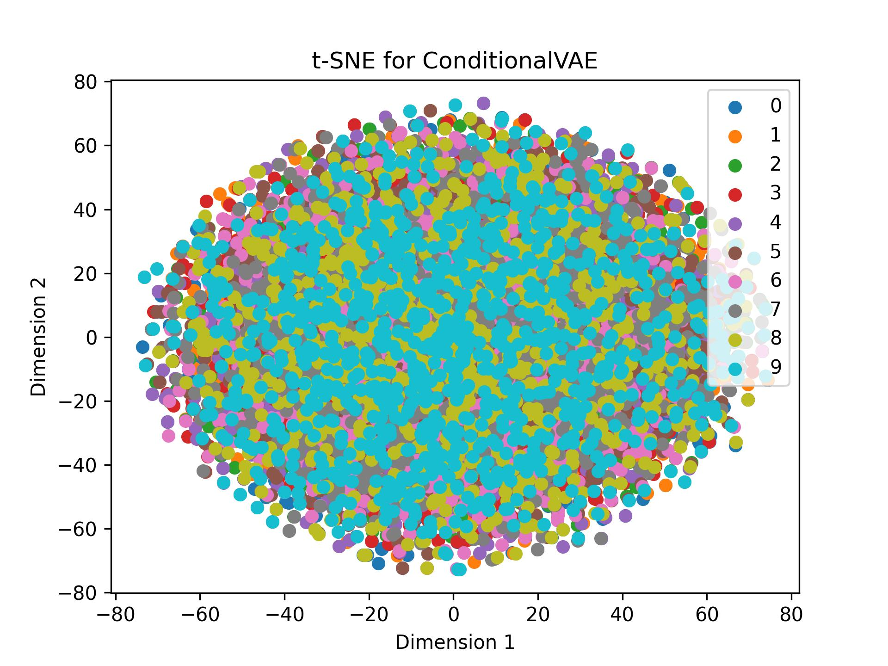

# Conditional Variational Autoencoders for MNIST Digit Generation
The goal of this project is to explore and better understand variational
autoencoders (VAEs), and how they are used for image generation in practice. In this
document, we will briefly describe VAEs, before walking through the implementation,
training (& validation), testing, and visualization.

## Introduction
Variational Autoencoders (VAEs) represent a powerful class of probabilistic 
generative models that aim to model an underlying distribution of real-world 
data. Coupled with their ability to learn deep representations of such data, 
VAEs are capable of generating entirely new data points using variational 
inference. Unlike traditional autoencoders, which deterministically reconstruct 
outputs from discrete latent representations, VAEs probabilistically generate 
outputs, by sampling from a continuous latent space. For any given input x, 
the encoder of a VAE attempts to learn a mapping of x to a probability 
distribution, which is assumed to be Gaussian (i.e. roughly standard normal). 
This property, sometimes referred to as latent space regularization, is 
achieved by incorporating Kullback-Leibler (KL) Divergence, which measures 
the distance (or dissimilarity) between two probabilities distributions, and 
effectively encourages the modeled latent distributions to be close to standard 
normal.

  

## Implementation
Model design and training were implemented in PyTorch.

### Architecture
The encoder and decoders use only linear layers and ReLU activations. To enable
differentiability, we use the "reparameterization trick," which allows sampling
from the latent distribution z ~ p_theta(z|x). The output is normalized between 
[0, 1.0] using the sigmoid function. Note that since the network is shallow,
additional normalization (e.g. batch normalization) is not necessary.

### Reparameterization Trick

  

### Loss
* __Reconstruction Loss__: To compare generated images with ground truth (original images),
we measure the reconstruction error. Common reconstruction losses include __Binary Cross Entropy (BCE)__
and __Mean Squared Error (MSE)__. While both are acceptable, in this implementation we use MSE loss, primarily for
two reasons: (1) BCE is both asymmetric and biased around p=0.5 [], and (2) BCE is designed for outputs that
model probabilities. Since images are supposed to...
* __KL Divergence__: Kullback-Leibler (KL) Divergence

## Training & Validation
A vanilla autoencoder (baseline) and VAE were trained on the MNIST
dataset, which contains handwritten digits labeled 0 through 9 (totaling 10 classes). 
The original training set consists of 60k images, each as 28 x 28, 8-bit unsigned
gray scale images. From this set, 10% were randomly chosen for validation (6k images)
to guide model selection. Each model was configured with a different latent size 
(i.e. 2, 5, 10, 20, 50, or 100). Training was conducted for 50 epochs on 
a single NVIDIA V100 GPU, utilizing batch sizes of 1024. Note that images were 
first converted to floating point tensors in the range [0, 1.0]. Optimization was 
carried using AdamW [], with a learning rate of 1e-3 and default weight decay parameters.
Training and validation losses were recorded for each epoch.

  
  

 
  <i>MSE over 100 epochs for training (left) and validation (right) for the <b>vanilla autoencoder</b>.</i>

  
  

 
  <i>MSE over 100 epochs for training (left) and validation (right) for the <b>VAE</b>.</i>

  
  

 
  <i>MSE over 100 epochs for training (left) and validation (right) for the <b>Conditional VAE</b>.</i>

### Reconstruction Error by Digit

  

  
  

* __Some digits are harder.__ Another important observation is that some digits are harder to reconstruction
than others. We see that digits 1 and 7 are easiest to reconstruct, since they
are both composed of straight lines, and digits 2 and 8 are hardest, as they
are more complex (loops and curves).

* Increasing the dimensionality of the latent space expectedly decreases image
reconstruction error across all digits for the vanilla autoencoder. In general,
increasing the degree of information that needs to be compressed by the encoder
makes it harder for the decoder to reconstruct the original image. 

* In contrast, for the VAE we see that higher latent sizes do not meaningfully
reduce reconstruction error. In fact, the MSE worsens slightly for nearly all 
digits, which perhaps reveals that either (1) the model is underfitting the data as
it struggles to generate continuous latent space representations, or (2) the model
is overfitting to the training data because of the increased capacity. Regardless,
it seems that most of the semantic information of MNIST digits can be compressed 
in a relatively small latent space.

### Model Selection: Choosing Optimal Latent Space Dimensionality 
Based on the reconstruction errors of the VAE model on the validation
split, a latent size of 20 was chosen. 

# Generating Handwritten Digits
There are two ways to generate digits. The first method uses both the encoder and
decoder to reconstruct an image. Although for this task this may seem trivial, 
many unsupervised anomaly detection methods essentially rely on the technique of comparing
an image x from its reconstruction x', whereby large reconstruction errors 
suggest potentially anomalous data. The second method, which only uses the decoder,
allows us to generate new digits "from scratch." We will see the limitations of 
vanilla autoencoders for decoder-only generation, and the benefit of latent space
regularization imposed on VAE models.

## Method 1: Encoder-Decoder Generation
### Process for Autoencoders
1. Compress image x into its latent representation z, i.e. z = enc(x).
2. Reconstruct image x' by feeding z into the decoder, i.e. x' = dec(z).
### Process for VAEs
1. Map image x to its latent posterior distribution p_theta(z|mu, sigma). 
2. Sample from the latent probability distribution using the reparameterization 
trick, z = sigma * eps + mu, where eps ~ N(0, 1).
2. Reconstruct image x' by feeding z into the decoder, i.e. x' = dec(z).
### Process for Conditional VAEs
1. Concatenate image x with its one-hot encoded label y, i.e. [x,y], to its
latent posterior distribution p_theta(z|mu, sigma). 
2. Sample from the latent probability distribution using the reparameterization trick, 
z = sigma * eps + mu, where eps ~ N(0, 1).
2. Concatenate z again with y, i.e. [z,y], and reconstruct image x' by feeding 
[z, y] into the decoder, i.e. x' = dec([z, y]).

### Visualizing Image Reconstruction
Below, we randomly sample 10 unseen images from the MNIST test split, and visualize
the encoder-decoder reconstructions for each model. 

  
  
  

 
  <i>Original handwritten digits and their reconstructions for the vanilla autoencoder (top),
  VAE (middle), and Conditional VAE (bottom).
  </i>

* __Fuzziness__: we see that the digits appear "fuzzy," which is expected because
of the probabilistic nature of the VAE.

### Decoder-Only Image Reconstruction (Generation)
What happens when we want to generate a new MNIST-like image? Well, we actually
don't need the encoder, and can feed a sample z ~ N(0, 1) to the decoder directly
to reconstruct an image, namely x' = dec(z):

  

 
  <i>Generated MNIST images using only the decoder portion of the VAE.</i>

* __Digits are randomly generated__: here, we see that the images produced are fairly decent, but some reconstructions 
are not identifiable. This is due to the fact that the VAE does not know which digits 
to produce, as it is only responsible for reconstructing an image from the sampled 
noise vector z. Because of this lack of information, z can lie somewhere in-between 
distributions in the latent space, representing a "mixture" of more than one digit.

### Guided Image Generation with ConditionalVAEs
Up until this point, the MNIST labels were not incorporated into the training 
process, and so the relationship between images and their labels could not be encoded
into the latent space. Can we somehow encode digit classes into the latent space,
such that specific digits can be generated on command? The answer is yes! By slightly modifying
the architecture of the VAE, we can allow the encoder and decoder to both 
accept an additional vector y. We simply one-hot encode the label and concatenate both
the input x and latent variable z, with the vectorized label. 
* __Modification__: We train the encoder to compress [x, z] together. Like before,
enc([x, z]) outputs a probability distribution given by mu and sigma. Using
the reparameterization trick (z = eps * sigma + mu), we circumvent having to 
sample z ~ N(mu, sigma), by randomly sampling eps ~ N(0, 1). Next, we feed the 
decoder [z, y], giving resulting output x' = dec([z, y]). 

By doing so, we can generate a new sample x' belonging to the class represented
by y, like so:

  

 
  <i>Generated MNIST images using the decoder portion of the Conditional VAE.</i>

### Visualizing the Latent Space

  

 
  <i>Clusters of digit classes using t-SNE (dimension=2) for the Autoencoder.</i>

  

 
  <i>Clusters of digit classes using t-SNE (dimension=2) for the VAE.</i>

  

 
  <i>Clusters of digit classes using t-SNE (dimension=2) for the ConditionalVAE.</i>

## Bonus: CIFAR-10
