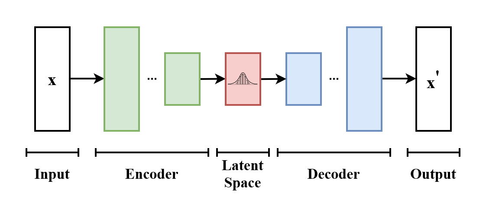

# Conditional Variational Autoencoders for MNIST Digit Generation
The goal of this project is to explore the key differences between autoencoders
and variational autoencoders (VAEs), and how these differences impact image
generation, even in simple applications like handwritten digit generation. A
step-by-step notebook can be found here, if you would like to follow along or
reproduce the figures and results.

## Introduction
Suppose we have a set of images $X$ (e.g. handwritten digits) that were drawn 
from some underlying probability distribution $p(x)$. Without knowing exactly
how samples are generated by this unknown real-world process, can we somehow
model this process with a neural network? In fact, generative models of the 
form p_{\theta}(x), aim to do exactly that, enabling us to generate new
samples.

### What is an Autoencoder?
An autoencoder is a type of neural network and belongs to the class of generative
models that aim to learn an underlying distribution of data $p(x)$. Typically,
when we collect a sample of images (e.g. handwritten digits) from the real-world,
we do not know exactly which probability distribution they were drawn from, which
is why 

Suppose the distribution
is a set of images $X$

It is composed of 
two parts, namely, the encoder and decoder. 

In the case 

Suppose we have a , an autoencoder

Variational Autoencoders (VAEs) represent a powerful class of probabilistic 
generative models that aim to model an underlying distribution of real-world 
data. Coupled with their ability to learn deep representations of such data, 
VAEs are capable of generating entirely new data points using variational 
inference. Unlike traditional autoencoders, which deterministically reconstruct 
outputs from discrete latent representations, VAEs probabilistically generate 
outputs, by sampling from a continuous latent space. For any given input x, 
the encoder of a VAE attempts to learn a mapping of x to a probability 
distribution, which is assumed to be Gaussian (i.e. roughly standard normal). 
This property, sometimes referred to as latent space regularization, is 
achieved by incorporating Kullback-Leibler (KL) Divergence, which measures 
the distance (or dissimilarity) between two probabilities distributions, and 
effectively encourages the modeled latent distributions to be close to standard 
normal.

  

## Implementation
Model design and training were implemented in PyTorch.

### Architecture
The encoder and decoders use only linear layers and ReLU activations. To enable
differentiability, we use the "reparameterization trick," which allows sampling
from the latent distribution z ~ p_theta(z|x). The output is normalized between 
[0, 1.0] using the sigmoid function. Note that since the network is shallow,
additional normalization (e.g. batch normalization) is not necessary.

### Reparameterization Trick

  

### Loss
* __Reconstruction Loss__: To compare generated images with ground truth (original images),
we measure the reconstruction error. Common reconstruction losses include __Binary Cross Entropy (BCE)__
and __Mean Squared Error (MSE)__. While both are acceptable, in this implementation we use MSE loss, primarily for
two reasons: (1) BCE is both asymmetric and biased around p=0.5 [], and (2) BCE is designed for outputs that
model probabilities. Since images are supposed to...
* __KL Divergence__: Kullback-Leibler (KL) Divergence

## Training & Validation
A vanilla autoencoder (baseline) and VAE were trained on the MNIST
dataset, which contains handwritten digits labeled 0 through 9 (totaling 10 classes). 
The original training set consists of 60k images, each as 28 x 28, 8-bit unsigned
gray scale images. From this set, 10% were randomly chosen for validation (6k images)
to guide model selection. Each model was configured with a different latent size 
(i.e. 2, 5, 10, 20, 50, or 100). Training was conducted for 50 epochs on 
a single NVIDIA V100 GPU, utilizing batch sizes of 1024. Note that images were 
first converted to floating point tensors in the range [0, 1.0]. Optimization was 
carried using AdamW [], with a learning rate of 1e-3 and default weight decay parameters.
Training and validation losses were recorded for each epoch.

  
  

 
  <i>MSE over 100 epochs for training (left) and validation (right) for the <b>vanilla autoencoder</b>.</i>

  
  

 
  <i>MSE over 100 epochs for training (left) and validation (right) for the <b>VAE</b>.</i>

  
  

 
  <i>MSE over 100 epochs for training (left) and validation (right) for the <b>Conditional VAE</b>.</i>

### Reconstruction Error by Digit

  

  
  

* __Some digits are harder.__ Another important observation is that some digits are harder to reconstruction
than others. We see that digits 1 and 7 are easiest to reconstruct, since they
are both composed of straight lines, and digits 2 and 8 are hardest, as they
are more complex (loops and curves).

* Increasing the dimensionality of the latent space expectedly decreases image
reconstruction error across all digits for the vanilla autoencoder. In general,
increasing the degree of information that needs to be compressed by the encoder
makes it harder for the decoder to reconstruct the original image. 

* In contrast, for the VAE we see that higher latent sizes do not meaningfully
reduce reconstruction error. In fact, the MSE worsens slightly for nearly all 
digits, which perhaps reveals that either (1) the model is underfitting the data as
it struggles to generate continuous latent space representations, or (2) the model
is overfitting to the training data because of the increased capacity. Regardless,
it seems that most of the semantic information of MNIST digits can be compressed 
in a relatively small latent space.

### Model Selection: Choosing Optimal Latent Space Dimensionality 
Based on the reconstruction errors of the VAE model on the validation
split, a latent size of 20 was chosen. 

## Generating Handwritten Digits
There are two ways to generate digits. The first method uses both the encoder and
decoder to reconstruct an image. Although for this task this may seem trivial, 
many unsupervised anomaly detection methods essentially rely on the technique of comparing
an image x from its reconstruction x', whereby large reconstruction errors 
suggest potentially anomalous data. The second method, which only uses the decoder,
allows us to generate new digits "from scratch." We will see the limitations of 
vanilla autoencoders for decoder-only generation, and the benefit of latent space
regularization imposed on VAE models.

### Method 1: Encoder-Decoder Generation
#### Process for Autoencoders
1. Compress image x into its latent representation z, i.e. z = enc(x).
2. Reconstruct image x' by feeding z into the decoder, i.e. x' = dec(z).

#### Process for VAEs
1. Map image x to its latent posterior distribution p_theta(z|mu, sigma). 
2. Sample from the latent probability distribution using the reparameterization 
trick, z = sigma * eps + mu, where eps ~ N(0, 1).
3. Reconstruct image x' by feeding z into the decoder, i.e. x' = dec(z).

#### Process for Conditional VAEs
1. Concatenate image x with its one-hot encoded label y, i.e. concat([x,y]), to its
latent posterior distribution p_theta(z|mu, sigma). 
2. Sample from the latent probability distribution using the reparameterization trick, 
z = sigma * eps + mu, where eps ~ N(0, 1).
3. Concatenate z again with y, i.e. concat([z,y]), and reconstruct image x' by feeding 
it into the decoder, i.e. x' = dec(concat([z, y])).

#### Visualizing Reconstructions
Below, we randomly sample 10 unseen images from the MNIST test split, and visualize
the encoder-decoder reconstructions for each model:

  
  
  

 
  <i>Original handwritten digits and their reconstructions for the vanilla autoencoder (top),
  VAE (middle), and Conditional VAE (bottom).
  </i>

* __Fuzziness__: we see that the digits appear "fuzzy," which is expected because
of the probabilistic nature of the VAE.
### Method 2: Decoder-Only Generation

#### Process
The process for decoder-only generation is exactly the same as that in Method 1,
except for the fact that instead of compressing x into its latent representation z,
we generate a noise vector z ~ N(0, 1), which simulates sampling from the latent 
space (under the assumption that it is roughly standard normal). In fact, we
don't even have an x to work with, so there is nothing to feed the encoder!

How do we specify which digit we want to generate? While we can only do this
with Conditional VAEs, we simply feed the one-hot label corresponding to the
digit of our choice, along with the noise vector to the decoder.

#### Visualizing Generated Digits
Below, we generate new MNIST-like handwritten digits from random noise vectors:

  
  
  

 
  <i>Generated digits from random noise vectors for the autoencoder (top),
  VAE (middle), and Conditional VAE (bottom).
  </i>

* __Unregularized Latent Space__: Unsurprisingly, we see that the vanilla autoencoder suffers to
generate anything resembling handwritten digits from the training set. This is
undeniably due to the lack of latent space regularization, hence why VAEs are more powerful. 
Because autoencoders deterministically maps a data point x to its latent representation z,
it will fail to generalize for an unseen z.

* Both the VAE and Conditional VAE produce recognizable digits. However, unlike
the Conditional VAE, which can generate specific digits on command, the 
unconditional VAE generates digits randomly, since it s only responsible 
for reconstructing x' from the sampled noise vector z, which encodes no
information about the digit class. Additionally, we see that the unconditional
VAE produces digits that are more ambiguous, while the Conditional VAE has seemingly
learned to "disentangle" the digit classes.

## Visualizing Latent Spaces

  
  

  
  

  
  

 
  <i>Latent representations in 2D (left) and density estimates for 1D representations
    (right) using PCA, for the Autoencoder (top), VAE (middle), and Conditional 
    VAE (bottom). 
  </i>

  
  
  

 
  <i>Latent representations in 2D using t-SNE for the Autoencoder (left), 
    VAE (middle), and Conditional VAE (right). 
  </i>

