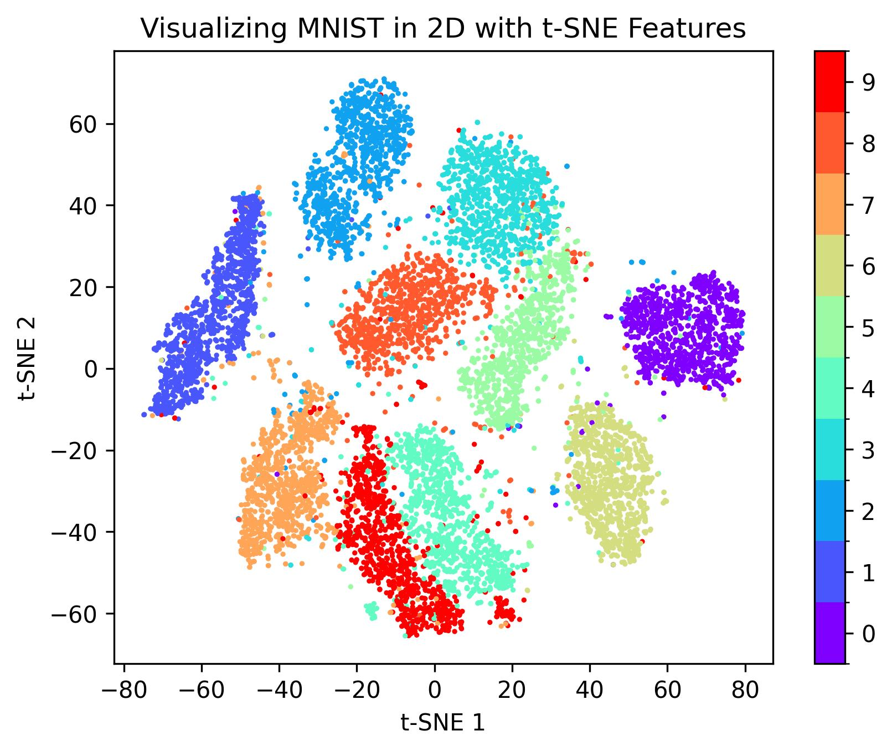
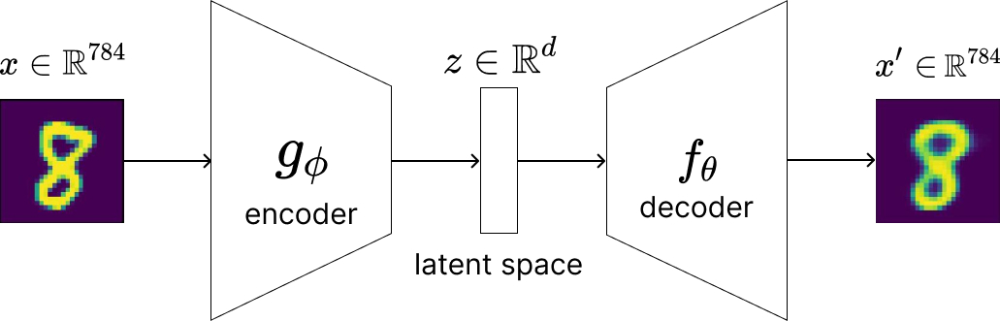
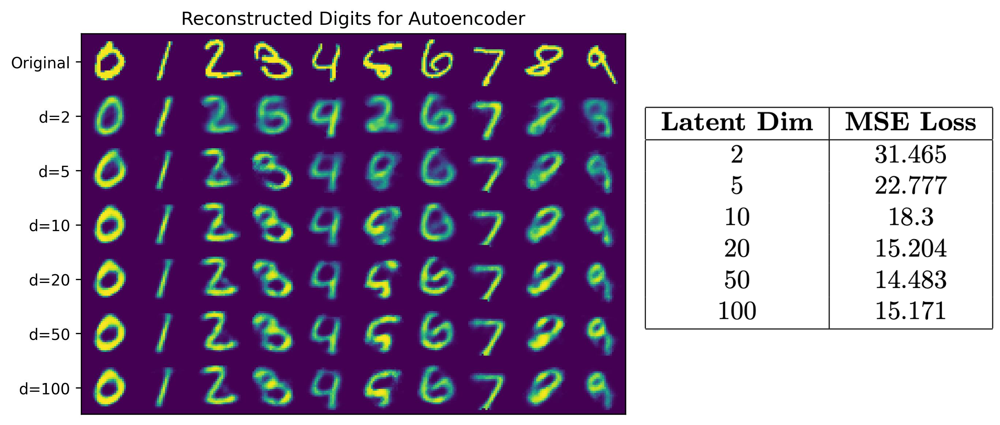
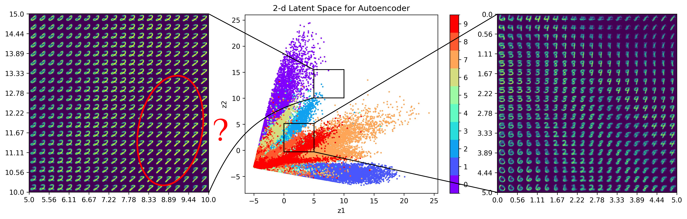
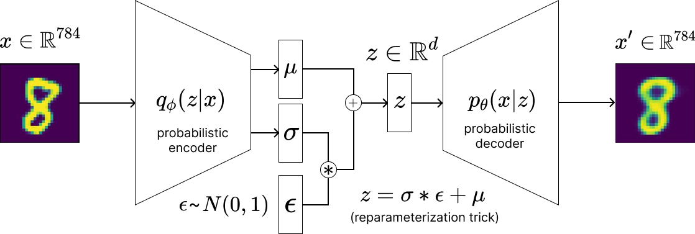
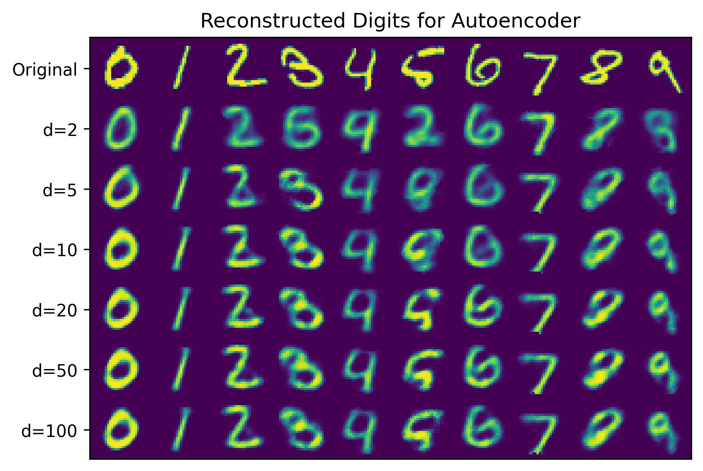
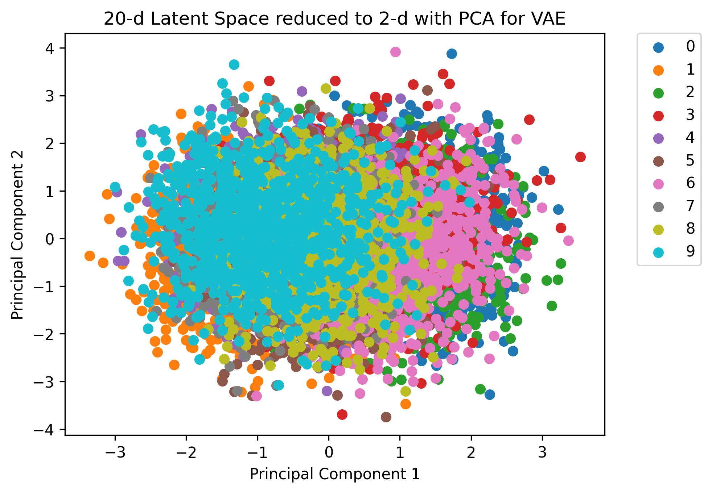
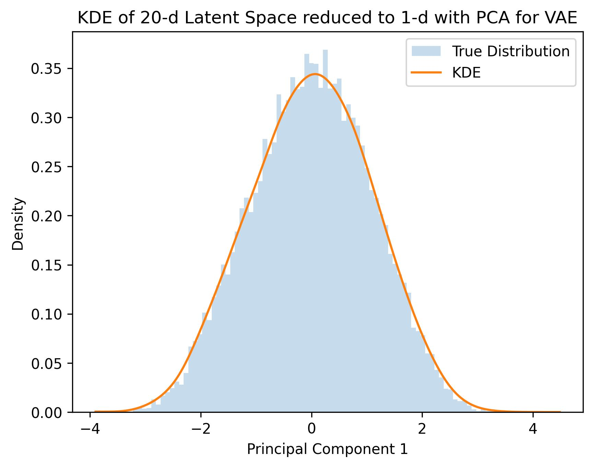

# Conditional Variational Autoencoders for MNIST Digit Generation
The goal of this project is to explore the key differences between autoencoders
and variational autoencoders (VAEs), and highlight how subtle differences with VAEs
allow them to greatly improve the generative capabilities of vanilla autoencoders,
even in simple applications like handwritten digit generation. If you would 
like to reproduce models and accompanying visualizations, please follow
along in [this]() jupyter notebook.

## Introduction
Suppose we have a set of images $X = \\{x_1,...,x_n\\}$ (e.g. handwritten digits 0-9) that were drawn 
from some underlying probability distribution $p(x)$, which we do not know. Undoubtedly,
they are generated by an unknown real-world process, but the question is: can it be modeled
by a neural network? As it turns out, the answer is yes. In fact, generative models 
of the form $p\_{θ}(x)$ attempt to approximate $p(x)$, and are designed exactly for the purpose of 
generating new data points that resemble those from $X$, by learning a set of
parameters $\theta$ that adequately capture important patterns in, and 
relationships between data points in $X$. 

What can be learned about $X$? Consider handwritten digits. If we have many, 
many examples of each digit, we will see differences in how they're written (Fig. 1a); 
however, among all examples, there will be similarities (otherwise they
wouldn't be the same digit). What's more is that for different digits, there are 
similarities too. Fig. 1b shows clusters of samples for each digit, where 9s and
4s, as well as 8s and 3s are closely related. 

  
  

    <i> Figure 1 (a, b). (a) Sample of 100 MNIST digits and (b) 10k MNIST images
    projected onto 2D space, using the t-SNE algorithm for dimensionality reduction. </i>

### Latent Space
The fact that MNIST digits can organized into clusters of similar digits using 
dimensionality reduction techniques like t-SNE (t-Distributed Stochastic Neighbor Embedding) [],
suggests that the essential features that make up digits, such as lines, loops, 
and curves, may live in a much lower-dimensional manifold []. In the context of 
machine learning, this lower-dimensional space is referred to as the _latent space_. 
Autoencoders, which we will introduce below, aim to represent high-dimensional data, 
such as MNIST digits $X \in \mathbb{R}^{784}$ in a much simpler form, $Z \in \mathbb{R}^{d}$.
By first learning about autoencoders, we will build the intuition behind VAEs, which impose a 
limitation on the structure of the latent space that leads to significantly 
more powerful generative capabilities.

### What is an Autoencoder?
An autoencoder (Fig. 2) is a neural network typically used in unsupervised learning tasks,
where the goal is to learn something about $X$ itself, and not its relationship with
a set of labels $Y$ (even if they exist).

  

    <i> Figure 2. Simplified diagram of an autoencoder. </i>

It is composed of two separate neural networks: an encoder $g_{\phi}$ and 
decoder $f_{\theta}$, which are typically symmetric (but not always) and have 
opposite roles.

#### Encoder
An encoder is a non-linear mapping $g_{\phi}: X \mapsto Z$, parameterized by 
$\phi$. The primary function of the encoder is to "encode" data $X$ 
into a compact latent representation $Z$, by learning the most salient features of $X$.
A good encoder will produce similar latent representations for similar inputs (and vice versa), 
meaning that different latent representations will be closer, or farther way from each other
in the latent space, depending on how similar, or dissimilar their inputs are.

#### Decoder
A decoder is also a linear mapping $f_{\theta}: Z \mapsto X$, parameterized by 
$\theta$, and can loosely be thought of as the inverse process. The primary function 
of the decoder is to "decode" latent representation $Z$ created by the encoder, 
and reconstruct $X$ from it. Like the encoder, a good decoder will be able to generate
similar reconstructions for similar latent representations, and vice versa.

Now you may ask, if the encoder and decoder are functionally inverse operations,
isn't the autoencoder just learning to approximate the identity function $I$? Yes,
but this is not trivial, since we have to remember that the latent space is typically
of much lower dimension than the original pixel space, which imposes a strict 
bottleneck. This bottleneck is what makes the encoder useful as a feature extractor.
Yet, this also comes with the cost of losing detail, since the decoder has to reconstruct
$X$ with potentially much less information.

### Measuring Reconstruction Error
How do we ensure that $X' \approx X$? Like many deep learning problems,
we iteratively update the model's parameters using some flavor of gradient descent,
which requires us to compute the gradient of some differentiable cost function. Two
commonly used cost functions for autoencoders include: _Binary Cross Entropy (BCE)_ 
and _Mean Squared Error (MSE)_. While both have been successfully used in practice, there
are reasons why MSE may actually be a safer choice (in fact, I had better results with it, 
but YMMV):

1. BCE is asymmetric []. While this property is useful for classification, 
where you may want to penalize false positives more than false negatives (or vice versa), it 
does not make much sense to penalize a pixel value of 0.6 more than 0.4 
(supposing the true value is 0.5). 
2. BCE is designed for outputs that model probabilities, while MSE is typically
used for regression. Explain more... 

In this implementation, we use MSE as our reconstruction loss, which is defined as:

$$ MSE = \frac{1}{N}||X - X'||_{2}^2$$

where N is the number of samples.

### Visualizing Reconstructions
Figure 3 shows reconstructed digits from MNIST test data for autoencoders
trained with various latent dimensions, using MSE as the reconstruction loss:

  

    <i> Figure 3. Sample of 10 reconstructed digits and MSE test losses across 
        various latent dimensions.
    </i>

We see that for all latent dimensions, the reconstructions appear "fuzzy," due
to the information lost during the compression process. While the worst reconstructions
are for $d=2$, how large should the dimensionality of the latent space really be?
We see that for $d > 20$, there really isn't much improvement, both visually and 
quantitatively.

### Benefits: Rich Feature Extraction
Okay, so suppose we've trained an optimal autoencoder that minimizes the reconstruction loss between $X$
and $X'$. What does this help us achieve? For one, we can obtain a rich feature
extractor in the form of the encoder, which can certainly be used for downstream applications
like classification. If you have a very large dataset of unpaired images, you can
train the whole autoencoder, and then use just the encoder as a pre-trained backbone. The features
learned by the encoder can be useful in transfer learning, where you may be dealing 
with a totally different kind of dataset, and fine-tuning, where you may not wish to, or even benefit from
training a model from scratch.

Another excellent use case for autoencoders is anomaly detection []. During test time,
when an autoencoder receives data that is similar to its training data, it will generally
produce decent reconstructions. However, what happens when test data is unlike anything seen
in the training set? It will most likely generate abnormal, noisy reconstructions, 
which may reveal the data to be anomalous. If the goal is to determine if some data is
anomalous, then we should be happy with this behavior. However, beyond the typical use
cases for vanilla autoencoders, this behavior is actually a significant limitation that makes
them a poor choice for generating new data points.

### Limitations: Data Generation
Up until this point, we've only looked at end-to-end generation, but what about 
generating new data points? To do so, we typically choose a random latent vector via
sampling, i.e. $z$ ~ $N(0, 1)$ and feed it to the decoder. Why choose $z$ randomly?
Since, we are not feeding an $x$ into the encoder, we still need a $z$ to generate $x'$,
and choosing one at random (i.e. from a standard normal distribution) is simple
and intuitive. Let's go ahead and see what a trained autoencoder with latent dimensionality
$d=2$ generates:

  

    <i> Figure 4. Generated digits sampling $z$ ~ $N(0, 1)$. </i>

Figure 4 shows weirdly reconstructed digits that are not really identifiable. 
Because the encoder is essentially a "black box," we cannot predict the structure 
of the latent space, and because of that, we cannot know exactly which $z$ will 
cleanly produce a digit. Figure 5 visualizes the exact latent space distribution
generated by the vanilla autoencoder for MNIST test data:

  

    <i> Figure 5. Generated digits from a grid in the 2D latent space.. </i>

In Fig. 5, we see two different areas of the latent space: one producing a grid 
of recognizable digits and the other not so much, for the most part. Paradoxically, 
we also see that the grid producing recognizable digits is more sparse. How could
this be the case? It is a well-known fact that autoencoders are prone to 
overfitting the training data (again, in some sense, this may be desirable if 
the goal is to detect anomalies). Thus, if we do not carefully feed the
decoder latent vectors that were already generated from images seen in the training 
process, then it is highly likely it will generate garbage. Fig. 5 well captures empty pockets in the 
latent space, which are effectively uncharted territory for the decoder. In effect, 
it will struggle to extrapolate to unseen latent representations. But even in the 
densely populated regions, there are tiny gaps that are unmapped. 

Hold on, I thought we said that similar latent representations should result in similar 
reconstructions? Yes, but because the latent space is unconstrained, the 
encoder will tend to produce a discrete latent space that makes it difficult 
to smoothly interpolate between points, even in close proximity. In the following section,
we will see how tweaking the encoder to be probabilistic (rather than deterministic)
and enforcing the structure of the latent space to be gaussian, radically improves
interpolation/extrapolation.

## Variational Autoencoders
Unlike vanilla autoencoders, variational autoencoders (VAEs) are _probabilistic_ 
generative models that explicitly aim to model $p(x)$ with an approximation
$p_{\theta}(x)$. Coupled with their ability to learn deep representations of such data, 
VAEs are capable of generating entirely new data points using variational 
inference. Unlike traditional autoencoders, which deterministically reconstruct 
outputs from discrete latent representations, VAEs probabilistically generate 
outputs, by sampling from a continuous latent space. For any given input x, 
the encoder of a VAE attempts to learn a mapping of x to a probability 
distribution, which is assumed to be Gaussian (i.e. roughly standard normal). 
This property, sometimes referred to as latent space regularization, is 
achieved by incorporating Kullback-Leibler (KL) Divergence, which measures 
the distance (or dissimilarity) between two probabilities distributions, and 
effectively encourages the modeled latent distributions to be close to standard 
normal.

  

    <i> Figure 5. Variational autoencoder. </i>

#### Evidence Lower Bound

#### Reparameterization Trick

#### Conditional VAEs

## Implementation
Model design and training were implemented in PyTorch.

### Architecture
The encoder and decoders use only linear layers and ReLU activations. To enable
differentiability, we use the "reparameterization trick," which allows sampling
from the latent distribution z ~ p_theta(z|x). The output is normalized between 
[0, 1.0] using the sigmoid function. Note that since the network is shallow,
additional normalization (e.g. batch normalization) is not necessary.

## Training & Validation
A vanilla autoencoder (baseline) and VAE were trained on the MNIST
dataset, which contains handwritten digits labeled 0 through 9 (totaling 10 classes). 
The original training set consists of 60k images, each as 28 x 28, 8-bit unsigned
gray scale images. From this set, 10% were randomly chosen for validation (6k images)
to guide model selection. Each model was configured with a different latent size 
(i.e. 2, 5, 10, 20, 50, or 100). Training was conducted for 50 epochs on 
a single NVIDIA V100 GPU, utilizing batch sizes of 1024. Note that images were 
first converted to floating point tensors in the range [0, 1.0]. Optimization was 
carried using AdamW [], with a learning rate of 1e-3 and default weight decay parameters.
Training and validation losses were recorded for each epoch.

  
  

 
  <i>MSE over 100 epochs for training (left) and validation (right) for the <b>vanilla autoencoder</b>.</i>

  
  

 
  <i>MSE over 100 epochs for training (left) and validation (right) for the <b>VAE</b>.</i>

  
  

 
  <i>MSE over 100 epochs for training (left) and validation (right) for the <b>Conditional VAE</b>.</i>

### Reconstruction Error by Digit

  

  
  

* __Some digits are harder.__ Another important observation is that some digits are harder to reconstruction
than others. We see that digits 1 and 7 are easiest to reconstruct, since they
are both composed of straight lines, and digits 2 and 8 are hardest, as they
are more complex (loops and curves).

* Increasing the dimensionality of the latent space expectedly decreases image
reconstruction error across all digits for the vanilla autoencoder. In general,
increasing the degree of information that needs to be compressed by the encoder
makes it harder for the decoder to reconstruct the original image. 

* In contrast, for the VAE we see that higher latent sizes do not meaningfully
reduce reconstruction error. In fact, the MSE worsens slightly for nearly all 
digits, which perhaps reveals that either (1) the model is underfitting the data as
it struggles to generate continuous latent space representations, or (2) the model
is overfitting to the training data because of the increased capacity. Regardless,
it seems that most of the semantic information of MNIST digits can be compressed 
in a relatively small latent space.

### Model Selection: Choosing Optimal Latent Space Dimensionality 
Based on the reconstruction errors of the VAE model on the validation
split, a latent size of 20 was chosen. 

## Generating Handwritten Digits
There are two ways to generate digits. The first method uses both the encoder and
decoder to reconstruct an image. Although for this task this may seem trivial, 
many unsupervised anomaly detection methods essentially rely on the technique of comparing
an image x from its reconstruction x', whereby large reconstruction errors 
suggest potentially anomalous data. The second method, which only uses the decoder,
allows us to generate new digits "from scratch." We will see the limitations of 
vanilla autoencoders for decoder-only generation, and the benefit of latent space
regularization imposed on VAE models.

### Method 1: Encoder-Decoder Generation
#### Process for Autoencoders
1. Compress image x into its latent representation z, i.e. z = enc(x).
2. Reconstruct image x' by feeding z into the decoder, i.e. x' = dec(z).

#### Process for VAEs
1. Map image x to its latent posterior distribution p_theta(z|mu, sigma). 
2. Sample from the latent probability distribution using the reparameterization 
trick, z = sigma * eps + mu, where eps ~ N(0, 1).
3. Reconstruct image x' by feeding z into the decoder, i.e. x' = dec(z).

#### Process for Conditional VAEs
1. Concatenate image x with its one-hot encoded label y, i.e. concat([x,y]), to its
latent posterior distribution p_theta(z|mu, sigma). 
2. Sample from the latent probability distribution using the reparameterization trick, 
z = sigma * eps + mu, where eps ~ N(0, 1).
3. Concatenate z again with y, i.e. concat([z,y]), and reconstruct image x' by feeding 
it into the decoder, i.e. x' = dec(concat([z, y])).

#### Visualizing Reconstructions
Below, we randomly sample 10 unseen images from the MNIST test split, and visualize
the encoder-decoder reconstructions for each model:

  
  
  

 
  <i>Original handwritten digits and their reconstructions for the vanilla autoencoder (top),
  VAE (middle), and Conditional VAE (bottom).
  </i>

* __Fuzziness__: we see that the digits appear "fuzzy," which is expected because
of the probabilistic nature of the VAE.
### Method 2: Decoder-Only Generation

#### Process
The process for decoder-only generation is exactly the same as that in Method 1,
except for the fact that instead of compressing x into its latent representation z,
we generate a noise vector z ~ N(0, 1), which simulates sampling from the latent 
space (under the assumption that it is roughly standard normal). In fact, we
don't even have an x to work with, so there is nothing to feed the encoder!

How do we specify which digit we want to generate? While we can only do this
with Conditional VAEs, we simply feed the one-hot label corresponding to the
digit of our choice, along with the noise vector to the decoder.

#### Visualizing Generated Digits
Below, we generate new MNIST-like handwritten digits from random noise vectors:

  
  
  

 
  <i>Generated digits from random noise vectors for the autoencoder (top),
  VAE (middle), and Conditional VAE (bottom).
  </i>

* __Unregularized Latent Space__: Unsurprisingly, we see that the vanilla autoencoder suffers to
generate anything resembling handwritten digits from the training set. This is
undeniably due to the lack of latent space regularization, hence why VAEs are more powerful. 
Because autoencoders deterministically maps a data point x to its latent representation z,
it will fail to generalize for an unseen z.

* Both the VAE and Conditional VAE produce recognizable digits. However, unlike
the Conditional VAE, which can generate specific digits on command, the 
unconditional VAE generates digits randomly, since it s only responsible 
for reconstructing x' from the sampled noise vector z, which encodes no
information about the digit class. Additionally, we see that the unconditional
VAE produces digits that are more ambiguous, while the Conditional VAE has seemingly
learned to "disentangle" the digit classes.

## Visualizing Latent Spaces

  
  

  
  

  
  

 
  <i>Figure 7. Latent representations in 2D (left) and density estimates for 1D representations
    (right) using PCA, for the Autoencoder (top), VAE (middle), and Conditional 
    VAE (bottom). 
  </i>

  
  
  

 
  <i>Figure 8. Latent representations projected onto 2D space using t-SNE
    algorithm for dimensionality reduction, for the Autoencoder (left), 
    VAE (middle), and conditional VAE (right). 
  </i>

Fig. 8 shows the latent representations projected onto 2D space when 
t-distributed Stochastic Neighbor Embedding (t-SNE) algorithm [] is applied to 
the latent representations. Since t-SNE is a non-linear dimensionality reduction
method, it applies a non-linear transformation that can separate data points
into clusters, unlike PCA, which applies a linear transformation using the
eigenvectors of the covariance matrix. For this reason, T-SNE is useful for
identify features or embeddings that share similarities (hence, are neighbors).

We see that for the autoencoder, the latent representations can be clustered
by their digits. The large gaps between clusters signify points in the reduced
latent space that do not encode meaningful information, so when an image gets mapped
to one of those regions in the original latent space, it will most certainly 
produce a noisy, meaningless image.

So you may be wondering why the conditional VAE's latent distribution looks 
more bivariate normal than the VAE. Since the one-hot encoding $Y$ is provided
to the encoder, the encoder does not need to "encode" any additional information
regarding the digit class into latent representations. Therefore, this allows
the encoder to encode more information about the actual styles and shape of 
digits, which can be shared across many digit classes. Instead, it is then
the job of the decoder to reconstruct the specific digit.

## Meaning of Latent Representations 
Okay, we now know that VAEs are particularly good at generating new digits
from latent representations, given their ability to manifest regularized latent
spaces. 

But what do the latent representations actually encode? Let's consider VAEs
with latent representations that live in 2D space. Typically, we sample $z ~ N(0, 1)$,
because the latent space is supposed to be approximately standard normal, hence 
why we can feed the decoder a random noise vector. But we don't have to do that.
Instead, we can traverse a subspace of the latent space, say, a 10 x 10 grid centered
around (0, 0). This allows us to see more clearly, the relationship between the 
components $(z_1, z_2)$ and the generated digit:

  
  

    <i> Figure 9. Generated digits corresponding to a grid of latent vectors 
        centered at (0, 0) for the VAE (left) and conditional VAE (right). </i>

* For unconditional VAEs, traversing the latent space in different directions 
changes the digit that is generated. We see that every digit class is accounted
for in the grid, and has a "center." Moving away from that center means moving
closer to another digit's center, and you can see digits morphing into other digits
(e.g. 7s morphing into 9s and 2s morphing into 8s). However, it is difficult to
see how the style of the digit is accounted for in the latent space, since the
digit classes are "entangled."

* For conditional VAEs, we see something even more interesting. Since it is the 
job of the decoder to reconstruct the specific digit when given a label, the encoder
can encode more primitive features that are shared among all digit classes, like
curves, rotation, and style. 
